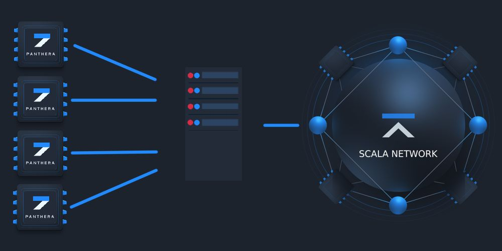

# XLArig Proxy

Extremely high performance [Scala (XLA)](http://scalaproject.io/) Stratum protocol proxy, can easily handle over 100K connections on cheap $5 (1024 MB) virtual machine. Reduce number of pool connections up to 256 times, 100K workers become just 391 worker on pool side. Written on C++/libuv same as [XLArig-proxy](https://github.com/aleksander-haugas/XLArig-proxy/).

## Compatibility
:warning: :warning: :warning: **Nicehash support must be enabled on miner side, it mandatory.** :warning: :warning: :warning:

* Compatible with any Monero, Electroneum, Sumokoin, Scala and AEON pools, except **nicehash.com**.
* Any miner with nicehash support, `--nicehash` option for [XLArig](https://github.com/scala-network/XLArig), `"nicehash_nonce": true,` for xmr-stak-cpu.
* [Comparison](https://github.com/xmrig/xmrig-proxy/wiki/Comparison) with other proxies.
* Added Scala with panthera support

## Why?
This proxy designed and created for handle donation traffic from XLARig. No one other solution works fine with high connection/disconnection rate.

## Download
* Binary releases: https://github.com/aleksander-haugas/XLArig-proxy/releases
* Git tree: https://github.com/aleksander-haugas/XLArig-proxy.git
  * Clone with `git clone https://github.com/aleksander-haugas/XLArig-proxy.git` :hammer: [Build instructions](https://github.com/aleksander-haugas/XLArig-proxy/wiki/Build).

## Donations

Default donation fee is 0% in the official pool and can be 1% in unofficial pools, also you can disable via `donate-level` option if the fee is 0%. Donation fee applies only if you use more than 256 miners.

* XMR (Original Dev): `48edfHu7V9Z84YzzMa6fUueoELZ9ZRXq9VetWzYGzKt52XU5xvqgzYnDK9URnRoJMk1j8nLwEVsaSWJ4fhdUyZijBGUicoD`
* XLA (Me) : `Ssy2AQ13Kf1cSJoqZ5Hkvd8RzDFmsWXu5XTe55qPADfFAHp37P7ioDXTU5d6uNb89368PRnxeb9rgjWsChs7BcV52M2jnRaqkV`

